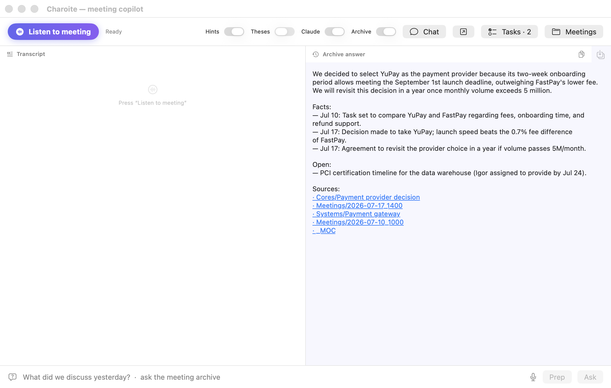
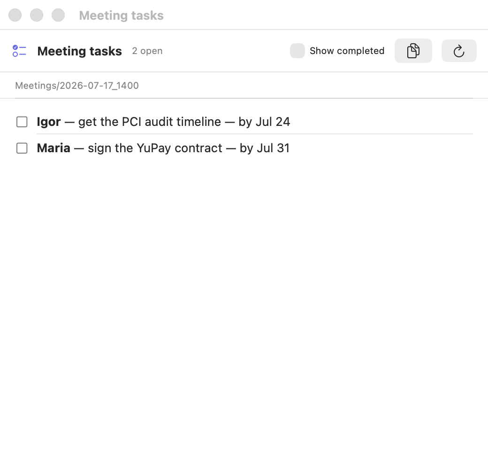

# Charoite

[](https://github.com/charoiteai/Charoite_audio/actions/workflows/ci.yml) [](https://github.com/charoiteai/Charoite_audio/actions/workflows/swift-tests.yml) [](https://github.com/charoiteai/Charoite_audio/actions/workflows/codeql.yml)    [](https://github.com/charoiteai/Charoite_audio/releases)

**Fully local AI meeting assistant with speaker diarization and a self-updating knowledge graph. Nothing ever leaves your Mac.**

Charoite listens to your meetings (microphone + system audio, no bots joining calls), transcribes them locally, tells speakers apart, answers questions mid-meeting, and after each meeting builds an Obsidian knowledge graph that remembers people, systems, decisions and recurring topics — across all your meetings.

*[Русский](README.ru.md) · [中文](README.zh.md). Charoite is Russian-first today (GigaAM STT is SOTA for Russian); English works via Parakeet/Whisper, Chinese via Whisper — and Qwen, the default LLM, is native in Chinese.*





## Why Charoite

- **100% local by default.** Audio, transcription, diarization, LLM summaries — all on your machine (Ollama + ONNX). No cloud, no telemetry, no accounts. The optional Claude layer is off unless you turn it on.
- **Speaker diarization that ships.** Live "Speaker 1/2/…" labels during the meeting, plus an offline re-pass over the full recording after the meeting for clean paragraphs per speaker. Names are assigned automatically when someone introduces themselves — never guessed.
- **A knowledge graph, not a pile of notes.** Meetings become episodes; people, systems and decisions become nodes; recurring topics become "Cores" with status and history. During a meeting Charoite whispers "⏮ this was discussed on Jul 15, status was …".
- **Layered output per meeting**: one-minute Summary (with links to what changed since past meetings) → Minutes → Debrief → full Transcript. Read as deep as you need.
- **Real-time help**: instant local answer when the other side asks you a question (⚡), auto-theses, live draft minutes, voice notes and dictation.

## Requirements

- Apple Silicon Mac (M1 or newer), 32 GB RAM recommended for the default models
- [Ollama](https://ollama.com) — see the RAM table below for which models fit
- Python 3.11+
- Optional: [BlackHole](https://existential.audio/blackhole/) to capture system audio (calls), [Obsidian](https://obsidian.md) to browse the graph

## Which models for your RAM

Everything runs locally. STT (~1 GB) and diarization (~0.5 GB) are constant;
the LLMs are what scale with memory. `num_ctx: 8192` throughout.
Semantic search adds `bge-m3` (~1.2 GB) — recommended at 16 GB+.

| RAM | Main LLM | Light LLM | Graph | Notes |
|----|----|----|----|----|
| **8 GB** | `qwen3.5:4b` | same | no | Transcript, theses, minutes, basic suggestions |
| **16 GB** | `gemma4:latest` | `qwen3.5:2b` | slow | Full live loop — recommended entry point |
| **32 GB** | `qwen3.6:35b-a3b` | `qwen3.5:4b` | yes | The default config, benchmarked here |
| **64 GB+** | `qwen3.6:35b-a3b` | `qwen3.5:4b` | yes | Headroom for the cloud Claude layer + long meetings |

Below 16 GB the knowledge graph is off (sub-30B models break the JSON schema);
on 4 GB run STT only and point `llm.base_url` at another machine.

**iOS/iPadOS**: the phone does STT + light generation, anything heavier goes to
a Mac over the REST API. On iOS 26+ the built-in ~3B Foundation Models handle
theses for free. Full macOS/iOS tables and the reasoning: [docs/MODELS.md](docs/MODELS.md).

## Quick start

```bash
git clone https://github.com/charoiteai/Charoite_audio && cd Charoite_audio
python3 -m venv .venv && .venv/bin/pip install -r requirements.txt
cp config/config.example.yaml config/config.yaml   # then set user_name & graph_dir
```

Working in English or Chinese? Use a language preset instead — English gets
Parakeet STT (English SOTA on Apple Silicon), Chinese gets Whisper STT with
Qwen (native Chinese) as the LLM, both get meeting documents and a copilot
role in your language:

```bash
cp config/config.example.en.yaml config/config.yaml   # English
cp config/config.example.zh.yaml config/config.yaml   # 中文
```

Something not working? One command shows what's missing and how to fix it:

```bash
python3 scripts/doctor.py
```

**Option A — the macOS app (recommended):**

Download `Charoite.app.zip` from the [latest release](https://github.com/charoiteai/Charoite_audio/releases/latest)
(first launch: right-click → Open, the bundle is ad-hoc signed), or build it yourself:

```bash
./app/make_app.sh && open app/build/Charoite.app
```

Live transcript, theses and hints, archive questions and briefs, local
chat with graph memory, dictation (⌥⌘D) and voice notes (⌥⌘N).

**Option B — CLI:**

```bash
.venv/bin/python src/main.py     # live transcript + hints in the terminal
```

**No meetings yet?** Point `graph_dir` at the bundled [demo graph](demo/)
(Russian) or [demo/graph_en](demo/) (English) and ask
«что решили по платёжному провайдеру?» / "what did we decide about the
payment provider?" — see the product working before recording anything.
One command validates the whole retrieval loop: `python3 scripts/memory_bench.py --demo`.
Got old recordings? One command imports a meeting file (audio/text/Zoom-subtitles) into the archive and the graph: `python3 scripts/import_meeting.py file --date 2026-07-15`. Or point the app at an import folder (Settings → Import) — recordings dropped there become meetings on their own. A replacement dictionary (`sufler.vocabulary`) fixes terms the STT keeps mangling, everywhere at once.

STT models download automatically on first run (GigaAM via `onnx_asr`). For live diarization put an ERes2Net speaker-embedding ONNX model at `models/diar/embedding.onnx` (see [docs/DIARIZATION.md](docs/DIARIZATION.md)).

## iPhone companion (app-ios/)

The phone is the microphone on the table, the Mac stays the brain. The
SwiftUI companion ([app-ios/](app-ios/)) records meetings, voice notes
and diary entries (background-safe, with a Live Activity timer in the
Dynamic Island), drops files into a user-chosen iCloud Drive folder with
an on-device outbox queue — and reads the graph back: a meetings feed
and task checkboxes straight from the same markdown files Obsidian and
the Mac app see. Build with XcodeGen: `cd app-ios && xcodegen generate`,
then open `CharoiteiOS.xcodeproj`.

## Documentation

- [Roadmap](ROADMAP.md) · [Contributing](CONTRIBUTING.md)

- [Setup](docs/SETUP.md) — install, BlackHole for calls, permissions, first run
- [Features](docs/FEATURES.md) — everything Charoite does, live and post-meeting
- [Architecture](docs/ARCHITECTURE.md) — the daemon, two-pass diarization, graph pipeline
- [Models](docs/MODELS.md) — why these defaults, with benchmarks; **RAM presets for macOS (4/8/16/32 GB) and iOS**
- [Diarization](docs/DIARIZATION.md) — embedding model setup and tuning
- [Design](docs/DESIGN.md) — shared tokens and UI conventions for macOS and iOS

## Privacy

See [PRIVACY.md](PRIVACY.md). Short version: no telemetry, no network calls except to your own localhost services (Ollama) — verify it yourself, it's all here. Recordings auto-delete after `record_keep_days`. Voice embeddings live only in RAM during a meeting; no voice prints are stored.

## Status

Public beta. Issues and feedback welcome. The native macOS app lives in [app/](app/) — build with `app/make_app.sh`. Roadmap: English graph nodes (docs phase done — `sufler.language: en`), speaker enrollment across meetings (voice → person node), packaged graph viewer.

## License

Apache-2.0.
