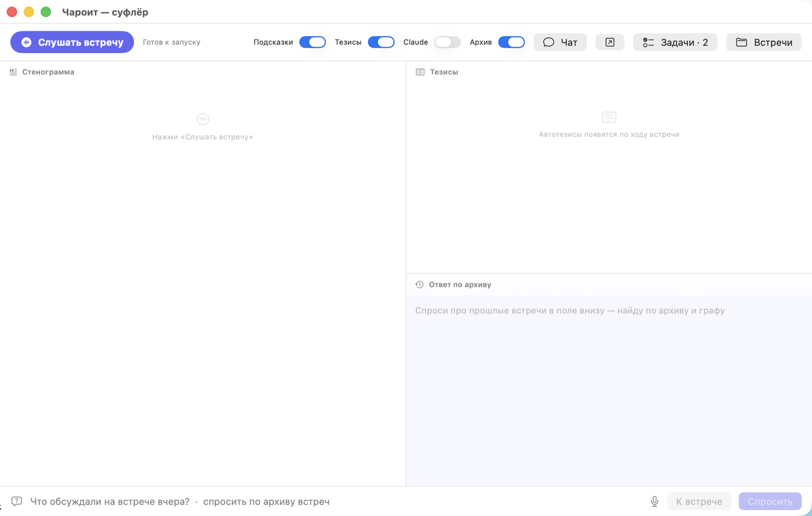
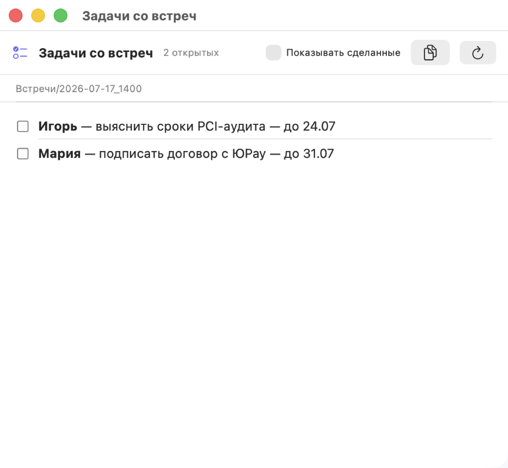

# Charoite (Чароит)

[](https://github.com/charoiteai/Charoite_audio/actions/workflows/ci.yml) [](https://github.com/charoiteai/Charoite_audio/actions/workflows/swift-tests.yml) [](https://github.com/charoiteai/Charoite_audio/actions/workflows/codeql.yml)    [](https://github.com/charoiteai/Charoite_audio/releases)

**Полностью локальный AI-ассистент встреч: диаризация спикеров и самообновляемый граф знаний. Ничего не покидает ваш Mac.**

*[English](../../README.md) · [中文](../zh/README.md)*

*Сегодня Чароит прежде всего русский (GigaAM — лучший STT для русского); английский идёт через Parakeet/Whisper, китайский — через SenseVoice или Whisper, а Qwen, LLM по умолчанию, для китайского родной.*

> **[Манифест: local-first — не local-only](MANIFESTO.md)** — чему месяцы на
> живых встречах научили нас о том, где локальные модели сильны и почему
> граф знаний ведёт сильная модель. Числа, границы и тест, который
> докажет, что мы неправы.





Чароит слушает встречи (микрофон + системный звук, без ботов в звонке), транскрибирует локально, различает говорящих, отвечает на вопросы прямо по ходу встречи, а после — обновляет Obsidian-граф знаний: люди, системы, решения и сквозные темы помнятся между встречами.

## Что умеет

- **Всё локально по умолчанию.** Аудио, распознавание (GigaAM — лучший русский STT), диаризация, саммари на Ollama — на вашей машине. Без облака, телеметрии и аккаунтов. Облачный слой — опция, по умолчанию выключен.
- **Диаризация, которая работает.** Живые метки «Собеседник 1/2/…» во время встречи + оффлайн-пересборка полной записи после — чистые абзацы по говорящим. Имя подставляется автоматически, когда человек представился, — и никогда не угадывается.
- **Граф знаний, а не свалка заметок.** Встречи — эпизоды; люди, системы, решения — узлы; сквозные темы — «Ядра» со статусом и хроникой. По ходу встречи суфлёр подсказывает: «⏮ уже обсуждалось 15.07, статус был такой».
- **Досье по темам.** Ночью локальная модель собирает по каждой сквозной теме сводку: состояние, хроника, решения, открытые вопросы, кто в теме — со ссылками на узлы-источники. Поиск смотрит в индекс досье **первым**, поэтому на «что в итоге по этой теме» отвечает готовая сводка, а не десяток разрозненных фрагментов. Пересборка инкрементальная: досье несёт отпечаток своих источников, и неизменившаяся тема модель не тревожит. Дописанное руками живёт в разделе «Правки автора» и переживает пересборку.
- **Облачные модели — опционально, на любом шаге.** По умолчанию выключены все пять рубильников до единого. Включаются по отдельности: разбор встречи после стопа (`cloud_enrich`), второе мнение в темпе разговора (`cloud_live`, плюс `cloud_hints` — уточнение каждой подсказки), ревизия досье с правом правки (`cloud_edit_graph`) — эти идут через Claude CLI по подписке, без API-ключа в окружении. Пятый, `cloud_engine`, переносит весь чат на названный вами OpenAI-совместимый шлюз (ключ — в отдельном файле), и ноутбук перестаёт держать большую модель. Что уходит в облако и что не уходит никогда — в [PRIVACY.md](PRIVACY.md).
- **Слои документов на каждую встречу**: Саммари на минуту чтения (со связью с прошлыми встречами) → Минутки → Разбор → полная Стенограмма. Читайте на ту глубину, которая нужна.
- **Помощь в реальном времени**: нить встречи на экране, мгновенный локальный ответ на вопрос собеседника (⚡), конспект последних минут по запросу, живой черновик минуток, голосовые заметки и диктовка.
- **Инструменты для Claude Code.** MCP-сервер (`src/mcp_server.py`) даёт Claude Code живую встречу: статус, стенограмму, подсказки, минутки и обновление графа. Работает только с папкой данных, названной при регистрации (`CHAROITE_ROOT`), — см. [установку](SETUP.md).

## Как это соотносится с другими

|  | Облачные ассистенты встреч | Локальные транскрибаторы | **Charoite** |
|---|:---:|:---:|:---:|
| Звук остаётся на вашей машине | ✗ | ✓ | ✓ |
| Без бота в звонке | иногда | ✓ | ✓ |
| Диаризация спикеров | ✓ | редко | ✓ |
| Подсказки по ходу встречи | ✓ | ✗ | ✓ |
| Память между встречами (граф) | ✗ | ✗ | ✓ |
| Полностью офлайн | ✗ | ✓ | ✓ |
| Открытый код | редко | иногда | ✓ |

Облачные ассистенты умны, но ваши разговоры живут на чужих серверах.
Локальные транскрибаторы берегут приватность, но забывают встречу в момент,
когда она закончилась. Charoite держит оба обещания: всё остаётся на Mac,
и каждая встреча делает следующую умнее.

## Требования

- Mac на Apple Silicon (M1+), macOS 14+ для приложения; рекомендуется 16 ГБ RAM — на 8 ГБ работает одна лёгкая модель, 32 и 64 ГБ открывают наборы крупнее (таблица ниже)
- [Ollama](https://ollama.com) — какие модели поместятся, см. таблицу по RAM ниже
- Python 3.11+ (только для запуска из исходников — приложение несёт свой контур)
- Звук звонков — средствами macOS (ScreenCaptureKit), настраивать нечего: система один раз спросит разрешение. [BlackHole](https://existential.audio/blackhole/) нужен только при отказе в разрешении или при запуске из терминала без приложения (поток ScreenCaptureKit поднимает приложение)
- Распознавание речи: вложенный контур приложения запускает GigaAM (русский) и SenseVoice (китайский и ещё четыре языка; модель ставит `scripts/get_models.py --stt sensevoice`); Parakeet и Whisper приходят с установкой из исходников (`pip install .`) или со сборкой бандла через `scripts/build_embedded_python.sh --extras`
- Опционально: [Obsidian](https://obsidian.md) для графа

## Какие модели под вашу RAM

Всё локально. STT (~1 ГБ) и диаризация (~0.5 ГБ) постоянны; с памятью
масштабируются LLM. Везде `num_ctx: 8192`.
Семантический поиск добавляет `bge-m3` (~1,2 ГБ) — рекомендуется от 16 ГБ.

| RAM | Основная LLM | Лёгкая LLM | Граф | Что получаешь |
|----|----|----|----|----|
| **8 ГБ** | `qwen3.5:4b` (3,2 ГБ) | та же | да | Одна модель на обе роли; дежавю и ревизия ядер выключены — оба поднимают `bge-m3`, который рядом не помещается |
| **16 ГБ** | `qwen3.5:4b` (3,2 ГБ) | та же | да | Та же модель, что на 8 ГБ, плюс семантическая память: дежавю и ревизия ядер (`bge-m3` помещается) |
| **32 ГБ** | `qwen3.8:27b-mlx` (16,9 ГБ) | `qwen3.5:4b` | да | Точнее по цитатам (96%), разбор втрое дольше — он фоновый |
| **64 ГБ+** | `qwen3.6:35b-mlx` (20,4 ГБ) | `qwen3.5:4b` | да | Рабочий набор: 42 решения и 39 ядер на встречу, медиана 57 с |

Цифры — бенч 19.08 на трёх реальных встречах (`scripts/bench_extract.py`,
методика 14.08). Он же снял старое правило «ниже 16 ГБ граф выключен»:
`qwen3.5:4b` разобрала все три встречи (31 решение, 30 ядер, 96% цитат) —
находок больше, чем у `gemma4:12b`, и втрое быстрее. Ломается на JSON не
класс размера, а конкретные модели: `GigaChat3.1-10B` не дала разбора в
пяти частях из шести и в таблицу не попала. На 4 ГБ — только STT; `llm.base_url` на другую свою машину — только с явным `llm.allow_remote: true` (стенограммы уходят с этого компьютера; под `CHAROITE_NO_CLOUD` запрещено — см. `docs/MODELS.md`).

**Телефоны**: сегодня моделей на них нет вовсе — компаньоны для iPhone и
Android записывают и доставляют звук, всё остальное делает Mac. STT и лёгкая
генерация на самом устройстве (на iOS 26+ — встроенными ~3B Foundation
Models) — план, а не выпущенная функция. Полные таблицы macOS, план для
телефонов и обоснование: [docs/ru/MODELS.md](MODELS.md).

## Быстрый старт

**Вариант A — macOS-приложение (рекомендуется).** Python внутри приложения:
ни `git clone`, ни `venv`, ни `pip`. Нужна только языковая модель:

Движок моделей и сами модели приложение ставит **само**: на первом запуске
оно покажет, чего не хватает, и предложит кнопку — без терминала.

Если предпочитаете руками:

```bash
brew install ollama && brew services start ollama
```

Тогда ставьте что-то одно: **либо brew, либо Ollama.app**. Приложение Ollama
поднимает свой сервер и занимает порт 11434, после чего brew-сервис молча
висит в `error`, а его обновления не применяются — подробности в
[SETUP.md](SETUP.md).

Скачайте `Charoite.dmg` из [последнего релиза](https://github.com/charoiteai/Charoite_audio/releases/latest)
и перетащите приложение в «Программы» — окно образа показывает, куда именно.
Релизные сборки подписаны сертификатом Developer ID и нотаризованы Apple —
приложение открывается обычным двойным кликом. Если вы собираете приложение
сами (или релиз вышел без секретов подписи — об этом сказано в его заметках),
бандл подписан ad-hoc — или подписан, но не нотаризован, — и при первом
запуске macOS его блокирует: Системные
настройки → Конфиденциальность и безопасность → *Всё равно открыть* (либо
`xattr -d com.apple.quarantine /Applications/Charoite.app`). Правый клик →
Открыть на macOS 15+ уже не работает.

Дальше приложение обновляется само: когда выходит новая версия, на вкладке
«Сегодня» появляется строка с кнопкой. Перед подменой скачанное обязано
сойтись с манифестом, подписанным личным ключом владельца (в GitHub и CI
этот ключ не попадает), и нести подпись Apple Developer ID проекта — иначе
обновление отменяется. Старая копия остаётся на месте до успешной подмены, а
во время записи встречи обновление не начнётся вовсе — перезапуск оборвал бы
запись. Рядом с образом лежит `Charoite.app.zip` — им обновляется уже
установленное приложение, и его же можно распаковать вручную.

Дальше всё в интерфейсе: мастер первого запуска спрашивает имя и папку
графа, показывает наборы моделей под память вашей машины и ставит их
кнопкой; разрешения на микрофон и системный звук macOS спросит сама. Свои
данные — конфиг, стенограммы, записи, логи — приложение держит в
`~/Library/Application Support/Charoite` (сменить — Настройки → Подключение →
Папка данных). Интерфейс и документы встреч следуют `sufler.language` в этом
конфиге — из коробки русский; `en` или `zh` переключают и то и другое после
перезапуска.

Живая стенограмма и нить встречи, подсказки и мгновенные ответы, вопросы и
брифы по архиву, локальный чат с памятью графа, диктовка (⌥⌘D), голосовые
заметки (⌥⌘N) и дневник (⌥⌘J). До предложения записи приложение проверяет
весь реальный контур встречи: python-контур, демон и конфиг, зависимости, микрофон и аудиовходы, модели
Ollama и папку графа. Отсутствие `bge-m3` или опционального графа показано
как ограничение, а не как неотличимая «поломка».

**Вариант B — из исходников** (разработка, своя сборка):

```bash
git clone https://github.com/charoiteai/Charoite_audio && cd Charoite_audio
python3 -m venv .venv && .venv/bin/pip install .
cp config/config.example.yaml config/config.yaml   # впишите user_name и graph_dir
CHAROITE_ROOT="$PWD" .venv/bin/python src/main.py     # живая стенограмма + подсказки в терминале
```

`CHAROITE_ROOT` называет папку данных: демон, `src/main.py`, пересборка
стенограммы и импорт не угадывают её по месту кода — без неё они
останавливаются со строкой-рецептом и кодом выхода 5. Английский пресет —
`config/config.example.en.yaml`, китайский — `config/config.example.zh.yaml`.

Своя сборка приложения с вложенным контуром:
`scripts/build_embedded_python.sh && app/make_app.sh`.

Что-то не работает? Одна команда покажет, чего не хватает и как починить:

```bash
python3 scripts/doctor.py
```

**Ещё нет встреч?** Наведите `graph_dir` на встроенный [демо-граф](demo/README.md)
(`demo/graph`; английский — `demo/graph_en`, китайский — `demo/graph_zh`)
и спросите «что решили по платёжному провайдеру?» — продукт виден до
первой записи. Одна команда проверяет весь контур: `.venv/bin/python scripts/memory_bench.py --demo` (`--demo-en`, `--demo-zh` — для двух других).
Есть старые записи? Одна команда импортирует файл встречи (аудио/текст/субтитры Zoom) в архив и граф: `CHAROITE_ROOT="$PWD" .venv/bin/python scripts/import_meeting.py файл --date 2026-07-15`. Или перетащите файл во вкладку «Внешняя запись», или укажите наблюдаемую папку (Настройки → Импорт записей) — упавшие туда записи сами станут встречами. Записи штатного Диктофона с iPhone приходят тем же путём (по согласию, `audio.voice_memos_bridge`). Словарь замен (`sufler.vocabulary`) чинит термины, которые STT упорно коверкает, — сразу везде.

STT-модели скачаются сами при первом запуске (GigaAM через `onnx_asr`). Живая диаризация («Собеседник 1/2/…» по голосам) просит одну команду: она ставит обе модели — сначала эмбеддинги, затем сегментацию (в приложении — кнопка в мастере первого запуска):

```bash
.venv/bin/python scripts/get_models.py --diar    # варианты эмбеддингов: --list
```

Без обоих файлов Чароит работает, но метки идут по каналам (вы и другая сторона), и демон говорит об этом на старте встречи. Одни эмбеддинги без сегментации оставляют живые метки в упрощённом режиме и не размечают голоса заново после встречи. Подробности — [docs/ru/DIARIZATION.md](DIARIZATION.md).

## Компаньон для iPhone (app-ios/)

Телефон — микрофон на столе, мозг остаётся на Mac. SwiftUI-компаньон
([app-ios/](app-ios/README.md)) записывает встречи, голосовые заметки и записи
дневника (безопасно в фоне, с таймером Live Activity и кнопкой «Стоп» в Dynamic Island),
кладёт файлы в выбранную вами папку iCloud Drive через локальную очередь
отправки — и читает граф обратно: лента встреч и чекбоксы задач прямо из тех
же markdown-файлов, которые видят Obsidian и приложение на Mac. Сборка через
XcodeGen: `cd app-ios && xcodegen generate`, затем откройте
`CharoiteiOS.xcodeproj`.

Открыли приложение — запись уже идёт (настройка, включена по умолчанию), а
App Intent «Начать запись в Charoite» делает то же из Siri, Команд или
кнопки действия. Звонок посреди записи — пауза, а не потеря: микрофон на
время уходит звонку, а после звонка приложение до минуты ждёт вход и
продолжает тот же файл; не вернулся вход — встреча продолжается новым
файлом. Если система не сообщит об окончании звонка (iOS этого не
гарантирует), приложение проверяет вход само — раз в полминуты после первой
минуты — и поднимает запись, как только микрофон освободится.

## Компаньон для Android (app-android/)

Та же роль для планшета или Android-телефона
([app-android/](app-android/README.md)): фоновая запись через foreground service,
локальная очередь, лента встреч и чекбоксы задач из тех же markdown-файлов.
Записи пишутся как 16 кГц моно WAV — ровно то, что нужно распознаванию, и
формат, переживающий падение, — и попадают в папку, которую вы выбираете один
раз; Mac видит эту папку через Syncthing или любой другой синхронизатор.
Сетевых разрешений у приложения нет вообще. Сборка:
`cd app-android && ./gradlew assembleDebug`.

## Документация

- [Планы](ROADMAP.md) · [Как контрибьютить](CONTRIBUTING.md)

- [Манифест](MANIFESTO.md) — почему конвейер ведут локальные модели, а граф — сильная
- [Установка](SETUP.md) — зависимости, конфиг, системный звук, права, первый запуск
- [Практическое руководство](USER_GUIDE.md) — весь путь от проверки готовности до карточки и повтора
- [Данные и восстановление](DATA_AND_RECOVERY.md) — где что хранится, сроки, резервные копии и безопасное восстановление
- [Возможности](FEATURES.md) — всё, что делает Чароит во время встречи и после
- [Архитектура](ARCHITECTURE.md) — демон, двухпроходная диаризация, пайплайн графа
- [Модели](MODELS.md) — почему такие дефолты, с бенчмарками; **пресеты по RAM для macOS (4/8/16/32/64 ГБ) и iOS**
- [Безопасность](SECURITY.md) — модель угроз: что покидает машину, изоляция prompt injection, supply chain
- [Диаризация](DIARIZATION.md) — эмбеддинги, сегментация и настройка
- [Дизайн](DESIGN.md) — общие токены и правила интерфейса для macOS и iOS

## Приватность

[PRIVACY.md](PRIVACY.md): телеметрии нет, сетевых вызовов кроме вашего localhost (Ollama) нет — проверьте сами, код открыт. Два названных исключения вне облачного слоя: проверка версии у публичного API GitHub (о вас ничего не уходит; `sufler.check_updates: false` выключает) и загрузка моделей; `CHAROITE_NO_CLOUD=1` отключает проверку версии и запрещает демону докачку весов по ходу работы (установка, которую вы запускаете сами, — ваше явное действие). Записи удаляются через `record_keep_days`. Голосовые эмбеддинги живут только в RAM встречи — слепки голосов не хранятся.

## Статус

Публичная бета — текущая версия на [странице релизов](https://github.com/charoiteai/Charoite_audio/releases/latest). Issues и фидбек приветствуются; вопросы — в [Discussions](https://github.com/charoiteai/Charoite_audio/discussions). Нативное macOS-приложение — в [app/](app/README.md), сборка `app/make_app.sh`; компаньон для iPhone — в [app-ios/](app-ios/README.md), компаньон для Android — в [app-android/](app-android/README.md). Планы — в [ROADMAP.md](ROADMAP.md): прямая доставка записей с телефонов по Wi-Fi, ответы по архиву с учётом связей графа, компаньон для iPhone в App Store и узлы графа прямо в приложении.

Если Charoite вам полезен — ⭐ помогает другим его найти.

## Лицензия

Apache-2.0.
